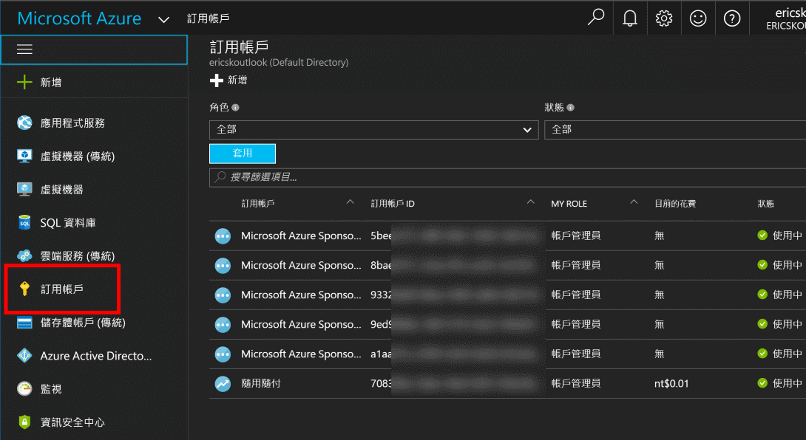
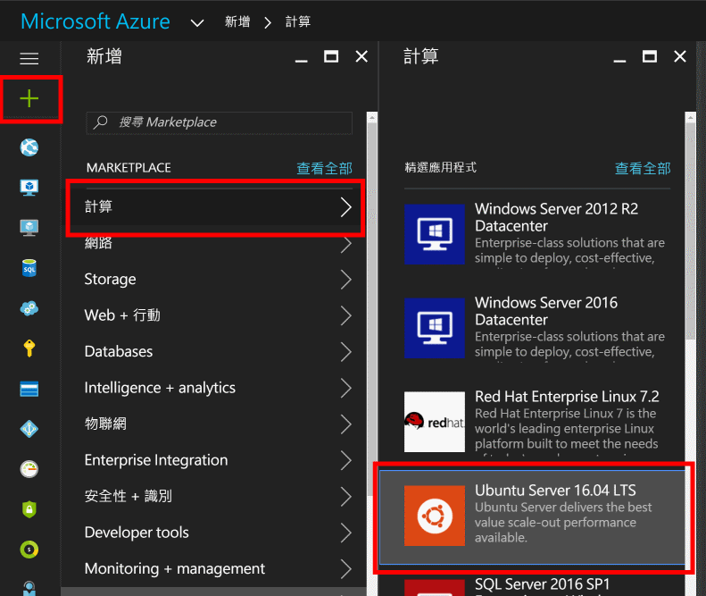
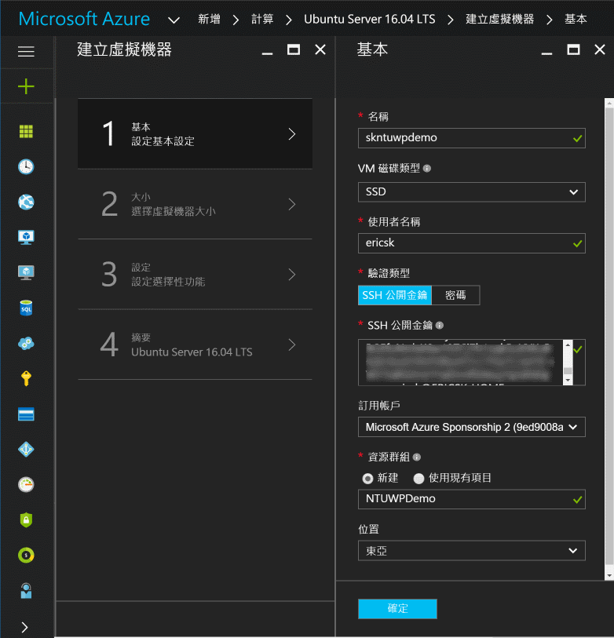
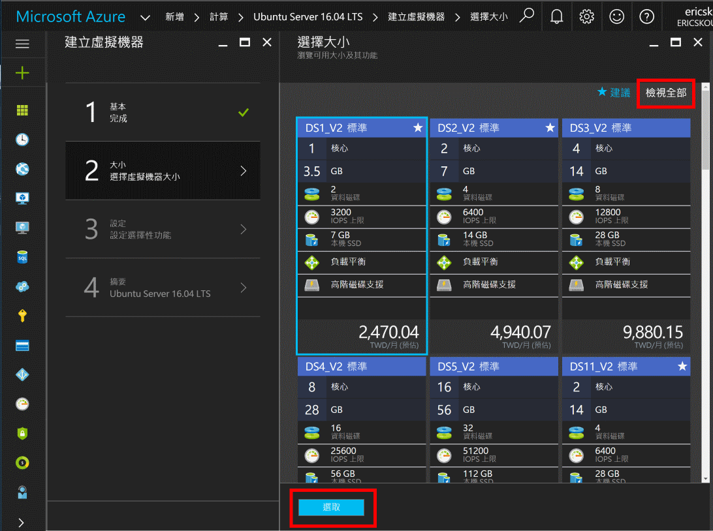
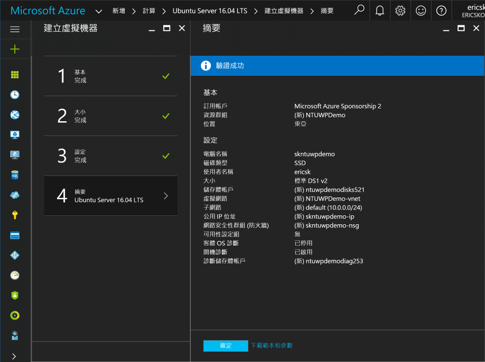
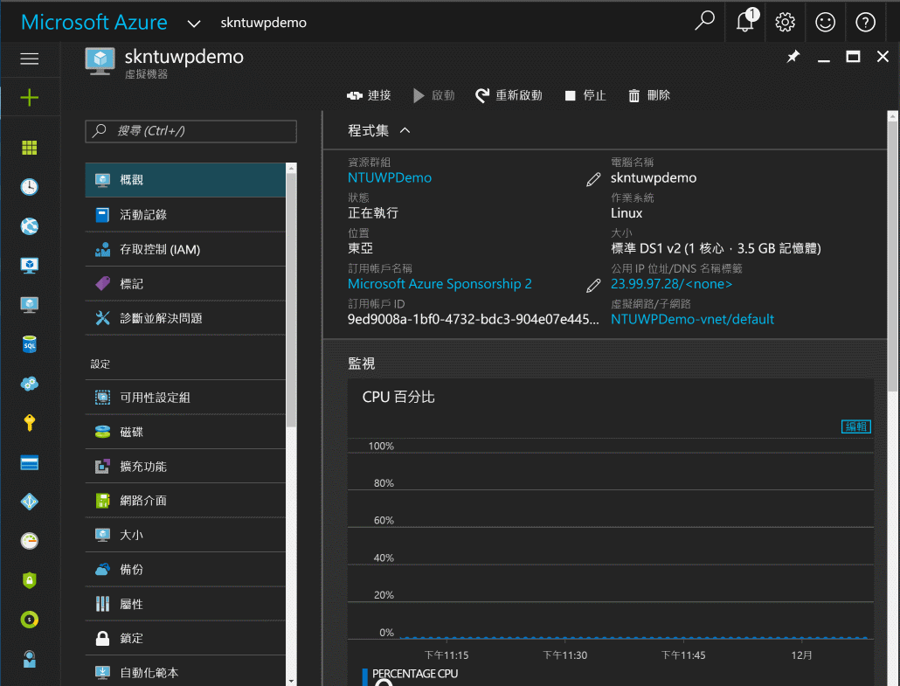
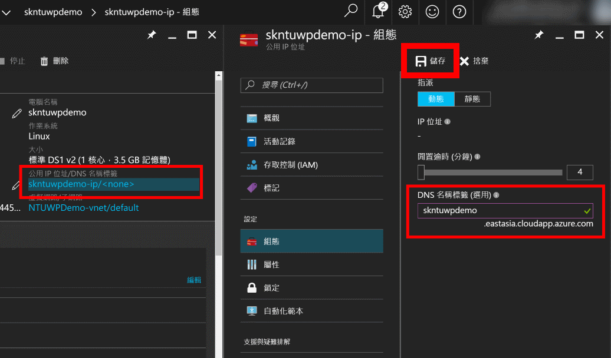

# 在 Microsoft Azure 上建立 Linux 虛擬機器

## 預計完成目標

完成本 Lab 後，你會在 Microsoft Azure 上擁有一台 Linux 的虛擬機器。

## 操作步驟

  1. 使用 Microsoft 帳號登入 [Microsoft Azure 入口網站](https://portal.azure.com/)，確定已經開通助教所給予的 Azure 訂閱。可以在畫面左側面板找到**訂用帳戶 (subscription)**，若沒在列表中看到，就到下方的**更多服務 (More Services)** 找到。

      

  2. 點擊左上角的 **+ 新增 (New)**，然後從分類中選擇**計算 (Compute)**，找到 **Ubuntu Server 16.04 LTS**，點擊後按下**建立 (Create)** 的按鈕。

      

  3. 建立虛擬機器主要有四個步驟，第一步驟是填寫這個虛擬機器的基本資料，填寫完成後按下下方的 **確定** 按鈕。

      * **名稱**: 虛擬機器的名稱，便於在 Azure 上管理及識別。
      * **VM 磁碟機類型**: 虛擬機器預帶的磁碟是 SSD 或 HDD，這個會影響後續選擇機器類型。
      * **使用者名稱**: 虛擬機器建立之後，第一個可以用來登入的帳號名稱。
      * **驗證類型**: 你可以選擇用 SSH 公開金鑰或密碼來進行帳號驗證，如果你不知道怎麼使用 SSH 公開金鑰就選擇_密碼_。

          > 如果使用 SSH 公開金鑰，別忘了 _使用者名稱_ 也要跟金鑰主人的帳號相同。

      * **訂用帳戶**: 選擇這個虛擬機器要開在哪個訂用帳戶之下。
      * **資源群組**: 建立虛擬機器後，同時也會建立與虛擬機器有關的資源（如：儲存體、虛擬網路、IP 設定等等）及服務，這裡只要設定一個群組名稱將這些服務一併群組管理。
      * **位置**: 選擇這個虛擬機器要開在哪一座 Azure 的機房。

      

  4. 設定好基本資料後，接下來就是選擇虛擬機器的大小，一開始只會顯示三個最常被使用的類型，你可以點選右上角的**檢視全部 (View all)** 來看到所有能選（會根據你前一步驟選了 SSD/HDD 以及資料中心位置有關）的虛擬機器大小，選擇其中一個大小後，按下下方的 **確定** 按鈕進入下一步驟。

      > 這裡看到的價格是指該大小的虛擬機器連續開一個月不關機的預估價格，而 Azure 虛擬機器的計價是以 **分鐘 (minute)** 為單位。詳細的內容請參考[官網上的價格頁面](https://azure.microsoft.com/zh-tw/pricing/details/virtual-machines/linux/)。

      

  5. 第三步驟是設定儲存體、虛擬網路等資料，這裡我們讓它保留預設值，直接進入下一步。最後一步會檢查所有的設定，如果沒有問題就能按下 **確定** 按鈕開始建立虛擬機器。

      

  6. 約 3 ~ 5 分鐘後，若沒有錯誤訊息，並且跳至虛擬機器的管理畫面，就表示建立成功，可以準備連線進去做事了！

      

  7. Linux 虛擬機器完成建立後，預設會開啟 SSH 連接埠（連接埠 22）供你連線進去管理，至於連線的 IP 位址可以在管理面板上找到，若您想要取一個好記的 domain name，可以在管理面板上點擊 IP 位址的欄位，接著就會帶你到設定頁面進行設定，填寫完畢別忘了要按下上方的 **儲存** 來儲存設定。

      

  8. 試試看能不能連線進你建立好的虛擬機器。

## 常見問題

  * Q: 填寫基本資料時出現紅色驚歎號怎麼辦？

    A: 紅色驚歎號通常表示輸入的資料格式有錯，可能是有重覆的內容，或是密碼複雜度不符規則等等，可以將游標移至驚歎號上方查看錯誤訊息。

  * Q: 如果我使用 SSH 公開金鑰設定貼錯金鑰內容、或是忘記密碼了怎麼辦？

    A: 在虛擬機器管理介面上有 **重設密碼** 的功能，可以在這裡重設 SSH 公開金鑰或是密碼。