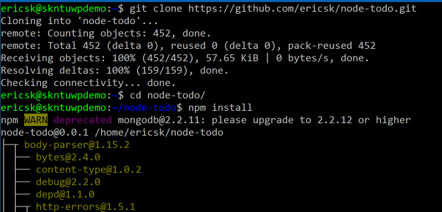
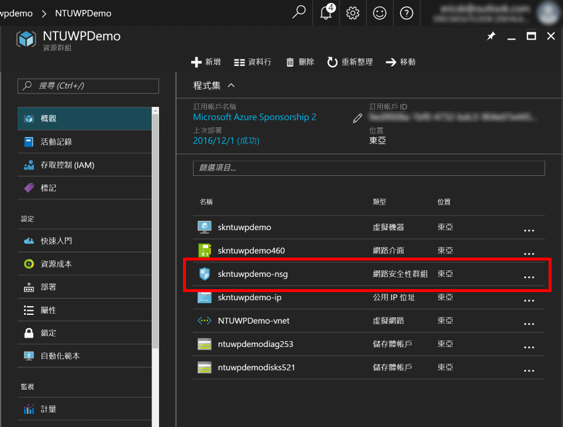
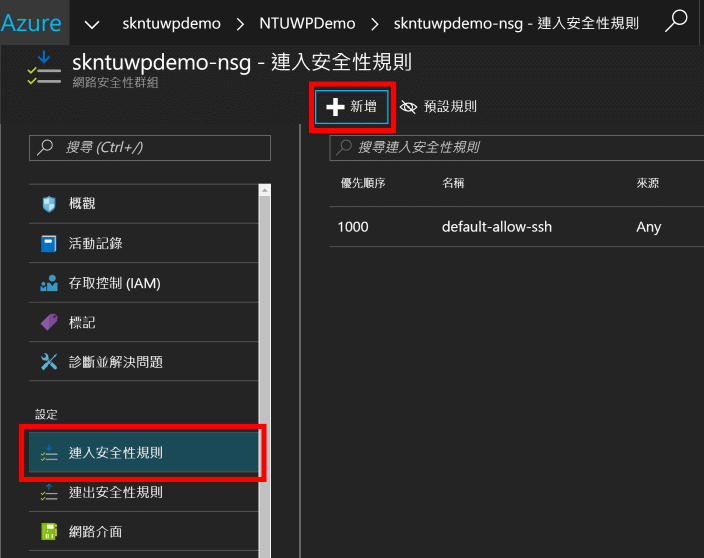
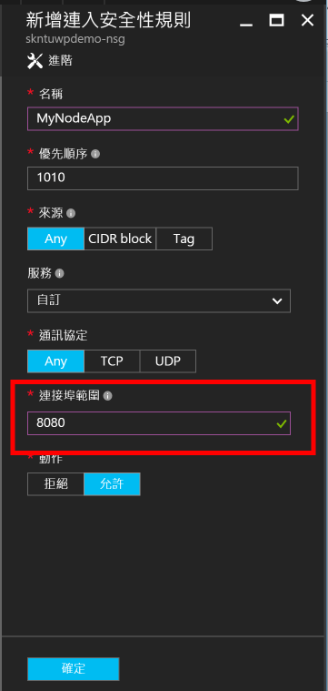
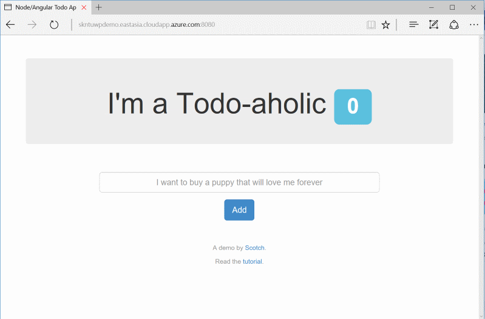

# 在 Linux 虛擬機器執行 MEAN stack 應用程式

## 預計完成目標

將一個以 MEAN (MongoDB + Express + AngularJS + NodeJS) stack 的應用程式成功執行在 Linux 虛擬機器上，並且對外提供服務。

## 操作步驟

  1. 連線進入剛才建立好的 Linux 虛擬機器，執行下列指令更新套件管理器的索引。

      > apt 是 Ubuntu Linux 常用的套件管理工具

      ```sudo apt update```

  2. 套件管理工具更新完畢後，執行下列指令安裝 Git、Node.js、NPM 以及 [MongoDB](https://www.mongodb.com/) 的軟體及環境，apt 會協助你安裝所有需要且相依的套件。執行之後會要你確認是否要安裝這些套件（包括所有相依的套件），按下 _Y_ 及 _Enter_ 後等待它安裝完畢。

      ```sudo apt install git nodejs npm mongodb```

  3. 安裝完成後，我們先將 MongoDB 的服務開起來，只要執行這行指令，若沒有錯誤訊息，那就是成功啟動了 MongoDB 的服務。

      ```sudo service mongodb start```

      > 也可以使用 ```sudo /etc/init.d/mongodb start``` 來開啟服務喔，而要關掉服務就只要把 _start_ 換成 _stop_ 即可。

  4. 接下來我們直接拿一個現成的 MEAN stack 專案來實驗，可以直接使用 git 來進行複製。複製完成後會在你的所在位置產生一個 _node-todo_ 的目錄，這就是我們要示範的應用程式。

      ```git clone https://github.com/ericsk/node-todo.git```

      > 這裡只是把檔案放在自己的目錄下，不牽扯系統層級的動作，所以不用 ```sudo``` 喔。

  5. 移到 _node-todo_ 的目錄下，因為這裡只有 node.js 的原始碼，還沒有把相關的套件（在 _package.json_ 下定義的）安裝回來，所以先在 _node-todo_ 的目錄下執行 ```npm install``` 來安裝所需的套件。

      

  6. 安裝完成後，執行 ```nodejs server.js``` 啟動應用程式，如果沒有錯誤訊息，並且看到 ```App listening on port 8080``` 那就表示你已經正確地把這個 MEAN stack 應用程式執行起來了！

  7. 但故事還沒結束，既然服務跑起來了，你可以試試看能不能夠打開瀏覽器，然後輸入 ```http://<你的domain name>.<資料中心>.cloudapp.azure.com:8080/``` 來存取這個 Todo 應用程式，你會發現無法建立連線，因為 Azure 幫你建立 Linux 虛擬機器時，預設只會開啟一個 SSH 的連接埠能傳輸資料，其它的連接埠都會被擋掉，所以我們還要再做一個步驟 -- _把連接埠 8080 打開_。

  8. 回到 Azure 入口網站，打開剛才建立虛擬機器的**資源群組**，找到裡面的**網路安全群組 (Network Security Group)** 項目，連接埠要通就得在這裡設定。

      

  9. 進入網路安全性群組的設定後，因為是虛擬機器上的服務要開放外部**連入**，所以我們必須新增一個**連入安全性規則 (Inbound Security Rule)**，點下 _連入安全性規則_ 後，再按 **新增** 加入一個新規則來開啟 8080 連接埠。

      

  10. 規則的設定很簡單，基本上只要填好名稱（不能有空白），然後連接埠要填入 **8080** 即可。最後按下 **確定** 讓它生效。

      

  11. 設定完成後，重新開瀏覽器連接你的網站，是不是就能順利看到這個應用程式的執行畫面了呢？

      

## 常見問題

  * Q: 我連不進虛擬機器耶～

    A: 回到虛擬機器的管理頁面上 **重設密碼**。

  * Q: 執行 nodejs server.js 時出現許多錯誤訊息。

    A: 要不是你忘了先 npm install 安裝相依套件，就是忘了把 MongoDB 的服務跑起來厚？